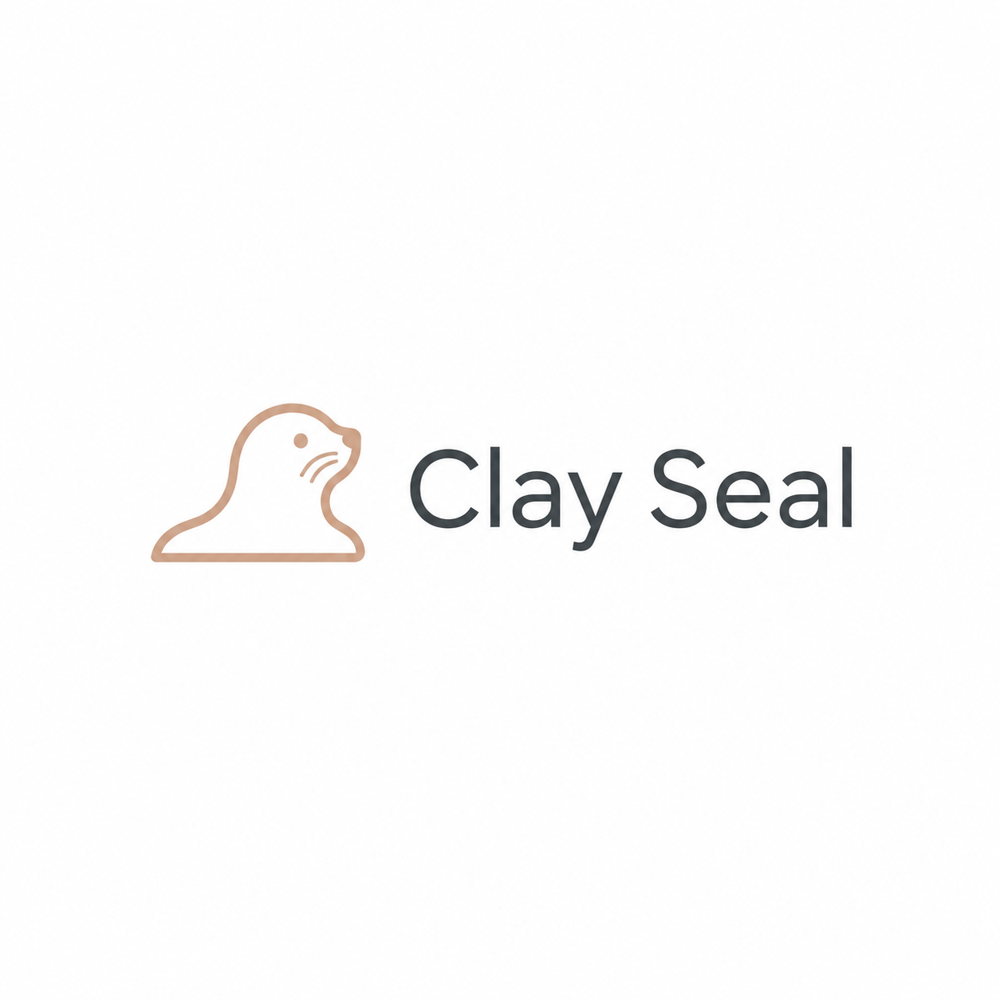

# Clay Seal Capabilities



Clay Seal Capabilities is layer 2 of Clay Seal: dynamic, action-scoped
authorization for autonomous agents. The package is still published as
`agentauth-capabilities` and imports from `agentauth.capabilities` for
compatibility while the product brand is Clay Seal.

Use this repo when you need to answer:

- May this agent perform this exact action right now?
- Is the action bound to a specific resource and input?
- Can a delegated sub-agent only receive narrower rights?
- Can the decision be verified offline by a gateway or receipt verifier?

## Current State

Implemented today:

- Signed commit tokens for one logical side effect.
- Input binding so mutated tool arguments invalidate authorization.
- Mandates, leases, delegation, and session value budgets.
- Goal-bound path scoping for coding-agent sandboxes.
- Syscall-level enforcement: an envelope's egress and path scope compile into
  [iVisor](https://github.com/yuvvantalreja/iVisor) sandbox policy, and its
  unforgeable verdict stream returns as attested evidence
  ([docs/ivisor_integration.md](docs/ivisor_integration.md)).
- Compute-seconds budgets, enforced by the sandbox timeout.
- A pluggable capability backend seam with a Biscuit default, and a matching
  `sandbox_backends` seam for execution substrates.
- Cross-provider identity adapters for native Clay Seal, SPIFFE JWT-SVID, OIDC,
  Auth0, AWS STS, Entra Agent ID, Azure AD, and GCP.
- Optional Redis/DynamoDB replay-defense stores for multi-instance gateways.

Layer 2 can be used without native Clay Seal Identity. Bring verified claims
from your IdP, build an `IdentitySession`, and issue commit tokens from there.

| Layer | Repository | Purpose |
| --- | --- | --- |
| Core | [clay-seal-core](https://github.com/pberlizov/clay-seal-core) | Shared contracts and crypto helpers |
| L1 | [clayseal-identity](https://github.com/pberlizov/clayseal-identity) | Native Clay Seal credentials |
| L2 | this repo | Commit tokens, mandates, leases, budgets |
| L3 | [clay-seal-receipts](https://github.com/pberlizov/clay-seal-receipts) | Verifiable receipts and audit |

## Install

Standalone editable development:

```bash
git clone https://github.com/pberlizov/clay-seal-core.git ../clay-seal-core
git clone https://github.com/pberlizov/clayseal-identity.git ../clayseal-identity
git clone https://github.com/pberlizov/clay-seal-capabilities.git
cd clay-seal-capabilities
python -m venv .venv && source .venv/bin/activate
pip install -e "../clay-seal-core[dev]"
pip install -e "../clayseal-identity[dev]"
pip install -e ".[dev]"
pytest python/tests -q
python examples/03_commit_token.py
python examples/04_cross_provider_commit.py
```

Pinned partner install:

```bash
pip install "git+https://github.com/pberlizov/clay-seal-core.git@v0.5.0"
pip install "git+https://github.com/pberlizov/clay-seal-capabilities.git@v0.5.0"
```

Optional extras:

```bash
pip install "agentauth-capabilities[biscuit-service]"  # native Biscuit-backed stack
pip install "agentauth-capabilities[oidc]"             # live OIDC/JWKS verification
pip install "agentauth-capabilities[spiffe]"           # SPIFFE Workload API
pip install "agentauth-capabilities[redis]"            # replay defense store
```

## Quickstart

```python
from agentauth.capabilities.commit import issue_commit_token, verify_commit_token
from agentauth.capabilities.identity_adapters import get_identity_provider
from agentauth.capabilities.integration import execution_context_from_session
from agentauth.core.signing import generate_keypair

session = get_identity_provider("oidc").build_session(
    verified_claims,
    evidence_verified=True,
)

ctx = execution_context_from_session(
    session,
    action_name="mcp.tools/call/payroll_bonus",
    resource_ref="rippling:bonus",
    input={"employee_id": "emp_123", "amount": 100},
)

key = generate_keypair()
token = issue_commit_token(ctx, key=key, ttl_seconds=300)
assert verify_commit_token(token, key=key.public_key()).valid
```

## Privacy and Data Handling

Layer 2 processes authorization context: subject identifiers, tenant IDs,
resource names, action names, input hashes, budget values, token IDs, and replay
state. It should not receive raw secrets or full sensitive payloads when a hash
or stable reference is sufficient.

Read [docs/PRIVACY.md](docs/PRIVACY.md) before routing production IdP claims or
business transaction data through capability checks.

## Documentation

- [Developer guide](docs/DEV_GUIDE.md)
- [Cross-layer integration](docs/cross_layer_integration.md)
- [Privacy and data handling](docs/PRIVACY.md)

## Compatibility Note

The public brand is Clay Seal. The package names and import paths intentionally
remain `agentauth-*` / `agentauth.*` for now so existing integrations keep
working.
