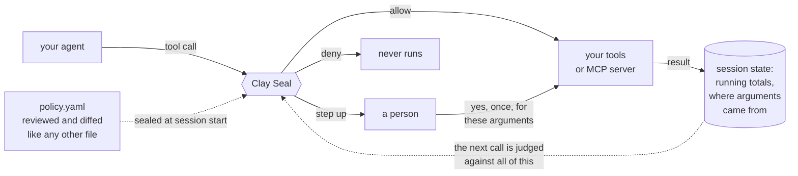

# Clay Seal


[](LICENSE)
[](pyproject.toml)
[](.github/workflows/ci.yml)
[](https://pypi.org/project/clayseal/)

**A policy gateway for AI agents. It stops the attack where every single call
is legitimate and the sequence is not.**

Your agent has a $1,000 refund ceiling. It issues eleven refunds of $900. Every
call is inside the per-refund limit, so every per-call check passes, and $9,900
goes out the door. Nothing that looks at one call at a time can see this.

Clay Seal sits in front of your tools and judges each call against the whole
session: the grant, the running totals, where the arguments came from, and what
the agent has already done.

## Start here

```bash
pip install clayseal
clayseal try
```

`clayseal try` takes about a minute. It runs two attacks in front of you and
shows the gateway stopping them. There is nothing to configure, no key to get
and nothing leaves your machine.


Every verdict there is decided live by the same gateway you would deploy. The
picture is generated from a real run by `python scripts/render_try_svg.py`, and
a test fails if it drifts from what the command prints, so it cannot become a
screenshot of something that used to work.

Python 3.10 to 3.14. Two dependencies, `cryptography` and `pyyaml`.

## Use it in two lines

Wrap the tools you already have. Nothing else about your agent changes.

```python
from clayseal.capabilities import Guardrail, Refused, StepUpRequired

def list_open_refunds():
    return [{"invoice": "INV-001", "amount": 900.0},
            {"invoice": "INV-002", "amount": 900.0}]

def issue_refund(invoice, amount):
    return f"refunded {invoice} ${amount:.2f}"

guard = Guardrail.from_dict({
    "version": 1,
    "goal": {"id": "refund-run",
             "summary": "Refund the invoices the customer disputed."},
    "expires_at": "2030-01-01T00:00:00Z",
    "tools": {"allow": ["list_open_refunds", "issue_refund"],
              "harmless": ["list_open_refunds"],
              "effects": {"list_open_refunds": "read", "issue_refund": "write"}},
    "paths": {"pathless": ["list_open_refunds", "issue_refund"]},
    "budgets": {"value": {"ceilings": {"refunds": "1000.00"},
                          "tracked": {"issue_refund": {"arg": "amount",
                                                       "budget": "refunds"}}}},
})
tools = guard.wrap_all({"list_open_refunds": list_open_refunds,
                        "issue_refund": issue_refund})

# Call them exactly as before. The gateway decides before the tool runs.
for row in tools["list_open_refunds"]():
    try:
        print(tools["issue_refund"](invoice=row["invoice"], amount=row["amount"]))
    except Refused as exc:
        print("refused:", exc.reasons)      # hand the reason back to the agent
    except StepUpRequired as exc:
        print("needs a human:", exc.reasons)
```

The first refund goes through. The second is refused, because the $1,000
session ceiling is already spent. Neither call reached your function.

The policy is inline here so you can paste the whole thing into a file and run
it. In a real deployment it lives in its own YAML, where a security team can
review it and a pull request can gate it. `clayseal policy new > policy.yaml`
writes a commented one to start from, and `Guardrail.from_policy_file` loads it.

The wrappers keep the name, docstring and signature of your originals, so any
framework that introspects them sees the tool it saw before. That covers
LangGraph, the OpenAI Agents SDK, CrewAI and hand-written loops, because they
all agree that a tool is a named callable taking keyword arguments.

## Or put it in front of an MCP server

No code change at all. The gateway speaks MCP, so it sits between your agent and
the server:

```bash
clayseal proxy --policy policy.yaml -- npx @your-org/mcp-server
```

Tools the policy does not grant are removed from the catalogue, so the agent is
never told they exist.

## Write the policy

This is a whole policy. It lints clean.

```yaml
version: 1

goal:
  id: refund-run
  summary: Refund the invoices the customer disputed.

expires_at: 2027-12-31T00:00:00Z

tools:
  allow:    [list_open_refunds, issue_refund]
  harmless: [list_open_refunds]                 # a read spends nothing
  effects:  {list_open_refunds: read, issue_refund: write}

paths:
  pathless: [list_open_refunds, issue_refund]   # these act on invoices, not files

budgets:
  value:
    ceilings: {refunds: "1000.00"}              # dollars, for the whole session
    tracked:
      issue_refund: {arg: amount, budget: refunds}
```

Run `clayseal policy lint policy.yaml` before you ship. It catches the mistake
that matters most: a tool that can spend money but debits no budget. On the file
above it reports no errors and two warnings, both of which name a real decision
you have not made yet.

Full reference: [docs/POLICY.md](https://github.com/clayseal/clayseal-capabilities/blob/main/docs/POLICY.md).

## See it stop the attack

From a checkout. [examples/](https://github.com/clayseal/clayseal-capabilities/blob/main/examples/) has five, each runnable with no key and
no network:

```bash
python examples/02_the_proxy.py
```

```
tools advertised to the agent: list_open_refunds, issue_refund
  (the server offers wire_funds; the policy does not grant it, so the agent is never told it exists)

  ok   issue_refund       INV-001   paid INV-001 $900.00
  DENY issue_refund       INV-002   refused by policy: value_budget_exceeded
  ...
  DENY issue_refund       INV-011   refused by policy: value_budget_exceeded
  DENY wire_funds         ops-float refused by policy: tool 'wire_funds' is not in this session's policy

the server executed 2 call(s):
  list_open_refunds {}
  issue_refund {"amount": 900.0, "invoice": "INV-001"}

clayseal proxy: 2 allowed, 11 denied, 0 held for approval; withheld from the catalog: wire_funds
```

Read the last block. A JSON-RPC error proves the agent was told
no; the server's own ledger proves the refund did not happen, and those are
different claims. The same run on the command line, which is the deployment
shape a deployment actually uses:

```bash
clayseal proxy --policy examples/refund.yaml -- python examples/refund_server.py
```

## How it works

You give the gateway a **policy file** and a **goal** for the session. It seals
the goal at the start, so nothing the agent reads later can widen what was
approved. Every tool call then goes through one decision point before it runs.



That loop at the bottom is the whole idea. The gateway does not just check a
call, it checks a call against everything the session has already done.

A call gets one of three answers:

- **allow** and the call goes to the tool
- **step up** and the call waits for a person to approve it
- **deny** and the call never runs

Step-up exists because a wrong refusal is expensive. An autonomous attacker is
stopped just as hard by a call that waits for approval as by one that is
refused, and a legitimate agent is not stopped permanently. Denial is reserved
for cases with positive evidence of a problem.

The checks that produce those answers run in a fixed order, cheapest and
strictest first, so a call refused early never reaches the expensive layers.

1. **Floor.** The flat rules: has the grant expired, is this tool allowed, is
   this path in scope, is this destination on the egress list, is there budget
   left. Fastest and most of the denials.
2. **Declaration.** If the agent states a plan up front, the plan is checked
   against the sealed goal before any of it runs.
3. **Content.** Checks that a declared write matches the goal, and inspects the
   payload of a write that has an effect. Produces a step-up, never a denial.
4. **Session state.** Running totals, which values came from untrusted text,
   and any rules written against them.
5. **Provenance.** Where a destination came from. A payee named in the sealed
   goal is trusted; one that appeared in text the agent read afterwards is not.
6. **Behavioural.** Watches the shape of the session against the goal. Advisory
   by default: it escalates, it does not block. Its blocking tiers are also
   arithmetically incapable of firing until enough benign sessions have been
   observed to calibrate them, because a conformal p-value cannot go below
   1/(n+1) and the alpha they are gated at sits under that floor. The detector
   names the inert tiers, so one that cannot fire does not look like one that
   looked and found nothing.

The word **budget** below means a running total the gateway keeps for the whole
session: money, calls, or anything else countable. It is the only check that can
see a sequence of individually legal calls adding up to something illegal, and
the measurements below show it is what decides whether this helps you.

## What it measures

One command, no model, no key, no network, a few seconds:

```bash
python -m benchmarks.bpl_sweep --suite full
```

132 business-process scenarios, each with a scripted attack and its benign twin.
Two columns, because either is trivially winnable alone: refuse everything and
you win containment, allow everything and you win completion. The column that
matters is the conjunction.

**The attack was contained AND its benign twin completed, full suite, n=132:**

| condition | contained and completed |
| --- | ---: |
| undefended | 0/132, 97.5% upper bound 2.8% |
| refuse everything | 0/132, 97.5% upper bound 2.8% |
| per-call authorization, given the policy | 0.8% (1/132) |
| dataflow taint | 11.4% (15/132) |
| **Clay Seal** | **39.4% (52/132)** |

Against dataflow taint that is **28.0 points [18.2, 37.9], exact McNemar
p=1.2e-07**. Of the 132 benign twins this gate refuses 2, and neither loses
work; taint refuses 49 and loses work on 43.

### The one number to read before the headline

**39.4% is an average over two different cases, not a rate.** What decides which
case you are in is the rule, and you can tell by reading your own policy before
running anything:

| Does the rule state a countable limit? | scenarios | Clay Seal | dataflow taint |
| --- | ---: | --- | --- |
| **yes** | 42 | **83.3% [69.4%, 91.7%]** | 2.4% [0.4%, 12.3%] |
| no | 90 | 18.9% [12.1%, 28.2%] | 15.6% [9.5%, 24.4%] |

Fisher exact p = 6.5e-11.

**So write your rules as ceilings on something you can count.** "No more than
$1,000 in refunds per session" is enforced. "Do not do anything inappropriate"
is not: there is no running total for the gateway to keep. `clayseal policy
lint` already flags a tool that can spend but debits no budget, and this
measurement is what that warning is worth.

### The rest of it

The suite above is one we wrote, which is the first thing to distrust.
[docs/EVIDENCE.md](https://github.com/clayseal/clayseal-capabilities/blob/main/docs/EVIDENCE.md) carries the evidence that is not ours,
what the gate costs, and the limits, in full:

| | |
| --- | --- |
| **An attacker that knows the defense** | 24 corpus and objective pairs, 173,699 candidates. In 23 of them, full visibility of the verdicts buys the attacker nothing. The 24th says what adaptivity is worth when it works |
| **Eleven external corpora** nobody here authored | 98 to 100% where harm is defined by something the gateway can bind to, 31 to 55% where it is defined by the content of an authorized action, and the friction column that says what an incomplete policy costs |
| **A live model**, AgentDojo prompt injection | 1 attack success in 216 runs, 0.5% [0.1, 2.6], against Progent's published 11.1 to 16.7% |
| **What that costs**, paired per task over four models | −25 points on the weakest, −3 on the strongest, where CaMeL's published cost is 7 |
| **34 µs per decision**, flat in session length | and the three numbers that are more interesting than the median |
| **The limit that outranks all of it** | on open-ended work where the next step cannot be known in advance, 21.67 interruptions per task |

Every headline result and the command that reproduces it:
[benchmarks/results/README.md](https://github.com/clayseal/clayseal-capabilities/blob/main/benchmarks/results/README.md).

## Where the boundary is

Three ways to place the enforcement point. They differ in what an agent has to do
to get past them, and the difference is worth stating plainly instead of
collapsing into one number.

| tier | mediates | got past by | status |
| --- | --- | --- | --- |
| in-process | tool calls your harness routes through `authorize()` | a harness that does not call it, or a tool nobody wrapped | shipped |
| **proxy** | **every tool call on the transport, by construction** | a process that can reach the tool another way | **shipped** |
| syscall | everything the guest can attempt, unforgeably | nothing at this layer | reference backend is macOS only |

The proxy also runs three checks the in-process path cannot. It screens every
path a call names, not just the one the action carries. It refuses a message
whose JSON has duplicate keys. And it holds an effectful call until earlier
results arrive, so it is never asked where a destination came from before it has
been told. The table in
[docs/POLICY.md](https://github.com/clayseal/clayseal-capabilities/blob/main/docs/POLICY.md) lists the differences, and what an in-process
integration has to do itself.

Most deployments want the proxy. The agent connects to `clayseal
proxy`, and `clayseal proxy` runs the real MCP server, so a denied call is
answered with a JSON-RPC error and the server subprocess never receives the
frame. Tools outside the policy are also removed from the advertised catalog, so
the agent does not plan around a tool it will then be refused.

The syscall tier compiles an envelope's egress and path scope into a sandbox
policy and takes back an unforgeable verdict stream
([docs/ivisor_integration.md](https://github.com/clayseal/clayseal-capabilities/blob/main/docs/ivisor_integration.md)). The reference backend
drives iVisor.

**It catches one class nothing above it can.** A DNS tunnel encodes its payload
into subdomains, and the data leaves through the resolver. No tool is
involved. There is no tool call, so `authorize()` is never asked, and every
layer above denies nothing. On the captured trace iVisor denies all four
queries and the tool-call layers deny none
([syscall_tier.md](https://github.com/clayseal/clayseal-capabilities/blob/main/benchmarks/results/syscall_tier.md)).

It runs the other way too. Beaconing over an allow-listed channel gives iVisor
nothing to refuse, because each syscall really is permitted; what is anomalous
is the running total, and only the session budget holds that. Neither layer
subsumes the other, which is the argument for running both.

iVisor is macOS only by construction: Hypervisor.framework allows one VM per
process and applies an irreversible Seatbelt profile to its caller. The
`agentauth.sandbox_backends` entry point makes the substrate swappable, and a
Linux seccomp or Landlock backend is open work, not something we ship.

### The gap this does not close

In-scope staging. An agent reads a secret-classed object inside its grant and
writes the content to a publication-classed object inside the same grant. Both
actions are authorized and the path scope cannot help, because the agent was
legitimately given the workspace that holds both. Measured against an oracle
attacker, the escaped-task set is byte-identical to `allow-all`
([in_scope_exfiltration.md](https://github.com/clayseal/clayseal-capabilities/blob/main/benchmarks/results/in_scope_exfiltration.md)). The
confidentiality flow tracker covers part of it as a step-up layer; wide fragment
splits and unkeyed encodings remain open. Any containment claim for a coding
agent has to carry this one.

## The policy document

The authority is a file, so a security team can read it, diff it in a pull
request, and gate a merge on it.

```yaml
version: 1
goal:
  id: billing-triage-2026-08
  summary: Triage the open billing tickets and email a summary to the ops archive.
profile: supervised          # autonomous | supervised | benchmark
expires_at: 2026-12-31T00:00:00Z

tools:
  allow:    [list_tickets, read_ticket, write_summary, send_email]
  harmless: [list_tickets, read_ticket, write_summary]
  effects:  {write_summary: write, send_email: send}

paths:
  allow: ["out/**", "tickets/**"]
  deny:  [".env", ".git/**"]
  arg_names: {write_summary: path}     # which argument carries the path
  pathless:  [send_email]              # asserted to act on no path

egress:
  domains: [acme-internal.com]
  bind_recipients: true

budgets:
  calls:
    ceilings: {emails: 3}
    tracked:  {send_email: emails}
```

```bash
clayseal policy show examples/policy.yaml   # what it authorizes
clayseal policy lint examples/policy.yaml   # what a reviewer should ask about
```

`lint` exits non-zero on an error finding, so it works as a pre-merge gate. It
reports what the gateway would refuse to start on, so the author does not find
out from a traceback:

```
ERROR   untracked-effectful-tool issue_refund: reachable and in the 'value'
        family but debits no budget, so no ceiling applies to it at all
WARNING session-scoped-ceiling   emails: counted per session, so a second
        session gets a second ceiling
```

The compiled policy carries a digest over the document, and the gateway attaches
it to every decision, so an audit trail says which authority produced a decision
and not only what the decision was.

### Pointing it at your own tools

Two declarations do the work, and both exist because the defaults are tuned on
benchmark catalogs, not on real ones.

`tools.effects` says what each tool does. The verb decides which floor rules
apply, and guessing it from the name works on names like `send_email` and fails
on names like `terraform_destroy`: of 24 tool names taken from widely used MCP
servers, 17 are unrecognised by the classifier.

`paths.arg_names` says which argument carries the path. The gateway looks for
`file_path`, `path`, `filename` and `file`; a tool that calls it `target_dir` or
`key` yields no path, and a path scope that cannot find a path does not apply. An
effectful call whose path cannot be resolved is refused, not allowed
unchecked, so the failure is loud instead of silent.

`clayseal policy lint` names every tool that is missing either one. Read
[docs/POLICY.md](https://github.com/clayseal/clayseal-capabilities/blob/main/docs/POLICY.md) before you write the first policy for a catalog
you did not design.

If the person who signs off works in risk and not engineering,
[docs/CONTROLS.md](https://github.com/clayseal/clayseal-capabilities/blob/main/docs/CONTROLS.md) says which obligations this produces
evidence for, quoting the framework text where the mapping is exact and staying
at the function level where it is not. It opens by saying what it is not: a
library is not a control regime and cannot make anyone compliant with
anything.

### Writing the first one from what you already have

Two commands exist so the first policy is not written from a blank file. Both
produce a **draft a person finishes**, never a grant.

```bash
# What the tools are called, from the server you already run.
clayseal policy init -- npx @your-org/mcp-server

# What the organisation permits, from the document that already says so.
clayseal policy draft delegation_of_authority.md

# Both halves in one file. This is the one worth running.
clayseal policy init --rules delegation_of_authority.md \
    -- npx @your-org/mcp-server > draft.yaml
clayseal policy lint draft.yaml
```

`init` asks the server for `tools/list` and reads the tool names, the effect of
each one, and the argument each carries its path in out of the schemas the
server already publishes. `draft` reads the ceilings, windows, once-only rules,
directories and allowed domains out of prose, from sentences like "a single
vendor payment must not exceed $10,000".

Neither one is authority, for two different reasons. The **document** is an
artefact edited by people who are not thinking about an agent, so whoever
controls it would otherwise control the grant. The **catalog** is written by the
server this policy constrains, so a server describing `wire_funds` as "reads the
balance" would be writing its own limits. Three properties follow:

- Every rule cites the line of the document it came from, so a reviewer checks
  the YAML against the sentence without re-reading the source.
- A sentence that reads like a rule and did not translate becomes a `TODO`
  comment. A draft that looks complete is worse than one that admits what it
  dropped, because a rule that vanished in translation is one nobody notices.
- The catalog may **raise** a tool's effect and never lower one, and a server
  calling its own effectful tool read-only is reported, not believed. A
  tool that publishes no schema is not recorded as taking no path: "the server
  did not say" and "the server said no" are different facts.

What is deliberately left blank is `budgets.tracked`, where a ceiling meets a
tool. The document knows the ceiling and the catalog knows which argument
carries the amount; which tool debits which ceiling is in neither, and naming
the wrong one splits a shared limit in two. Both are printed as commented
suggestions for a person to connect.

Worked end to end on a 30-line delegation-of-authority document and a seven-tool
AP server. It extracted 9 rules and left 3 sentences as TODOs. After review the
gateway denies four things: a payment taking the rolling 24-hour total past
$50,000, a second payment of an invoice already paid, a write to a `.ledger`
file, and a write outside `/finance/ap/`. One of those TODOs is
"the person who prepares a payment may not approve it", which is a real rule
this layer does not express, and it appears as a comment in the output, not a
silence.

## Adding a rule for your own workload

Every knob above tunes behaviour someone else chose. This is where "in our shop
X is also forbidden" goes, without forking:

```python
from clayseal.capabilities.session_rules import SessionRuleHit

def no_competitor_domains(action, session, *, goal_summary, egress_verbs):
    if "competitor.test" in str(action.args or {}):
        return SessionRuleHit("house-rules", "destination is a competitor domain")
    return None      # None means "this rule has nothing to say"

stack = DeployableStack.from_goal(goal, house_rules=(no_competitor_domains,))
```

A hit becomes a **step-up, never a denial**. A rule written against your
workload has not been measured against the traffic it will refuse, and a
step-up halts an autonomous attacker just as hard while leaving a person able
to say yes. Your rules run after the shipped ones, so a house rule cannot mask
one that ships. A rule that raises is skipped and counted in
`session_rules.RULE_FAILURES`, and the decision still goes through. A gateway
that stops authorizing because a regex threw is worse than one that misses a
rule.

## The lower-level API

`Guardrail` above is the wrapper most integrations want. If you are building
your own loop and would rather call the gateway directly, the decision API is
one method:

```python
from clayseal.capabilities.monitor.action import Action
from clayseal.capabilities.policy import load_policy
from clayseal.capabilities.tool_verbs import classify_verb

gateway = load_policy("examples/policy.yaml").build()

agent_calls = [
    ("read_ticket", {"id": "T-1042"}),
    ("send_email", {"to": "ops@acme-internal.com", "body": "3 open, 1 escalated"}),
    ("send_email", {"to": "collector-metrics.example", "body": "3 open, 1 escalated"}),
]

for step, (tool, args) in enumerate(agent_calls):
    decision = gateway.authorize(Action(
        step=step, tool=tool, resource=f"mcp:tool:{tool}",
        verb=classify_verb(tool), args=args,
    ))
    print(tool, decision.outcome, decision.reasons)
    if not decision.allowed:
        continue                    # hand the reasons back to the agent
    # run(tool, args)
```

`examples/01_gateway.py` runs this end to end against a prompt injection planted
in a ticket the agent was allowed to read. The fourth call is allowed and the
fifth is held for a person.

**What stops it there is the egress allow-list, which is a per-call rule.** The
injected address is off-domain, so the cheapest floor catches it and the
provenance layer is never consulted. That is the gateway working in the right
order, and it is not a demonstration of anything this document claims is
distinctive, so the example prints which layer fired and
[examples/README.md](https://github.com/clayseal/clayseal-capabilities/blob/main/examples/README.md) runs the same session with the domain
list removed, where provenance is what answers.

If your policy names a domain and an attacker names an address inside it, the
floor has nothing to say and `egress.recipients` is what binds the mailbox. It
is not on by default and `clayseal policy lint` does not require it, so a
policy that grants a domain grants every mailbox on it.

## Security posture

The guards fail closed unless the environment names itself development.

```bash
CLAYSEAL_ENV=development    # relaxes them, and says so once per process
```

Unset, or set to production, means an unpinned commit-token minting key is
refused, a missing replay store is refused, an unsigned step-up approval is
refused, and an intent envelope from an unpinned signer is refused. The polarity
used to be the other way around, which meant every deployment that had not read
this section accepted all four.

See [docs/THREAT_MODEL.md](https://github.com/clayseal/clayseal-capabilities/blob/main/docs/THREAT_MODEL.md) for what is signed, who signs
it, and what is out of scope.

## Build from source

```bash
git clone https://github.com/clayseal/clayseal-capabilities.git
cd clayseal-capabilities
python -m venv .venv && source .venv/bin/activate
pip install -e ".[dev]"
pytest python/tests -q
python examples/01_gateway.py
```

Optional extras:

```bash
pip install "clayseal[oidc]"     # live OIDC/JWKS verification
pip install "clayseal[spiffe]"   # SPIFFE Workload API
pip install "clayseal[redis]"    # shared replay and ledger stores
pip install "clayseal[monitor]"  # the learned trajectory scorer
```

## Identity

The gateway does not need an identity layer. Bring verified claims from your own
IdP, build an `IdentitySession`, and issue commit tokens from there. Adapters
ship for SPIFFE JWT-SVID, OIDC, Auth0, AWS STS, Entra Agent ID, Azure AD, GCP,
and A2A signed agent cards.

```python
from clayseal.capabilities.identity_adapters import get_identity_provider

session = get_identity_provider("oidc").build_session(
    verified_claims,          # your IdP already checked signature, aud, exp
    evidence_verified=True,
)
```

## Documentation

[docs/README.md](https://github.com/clayseal/clayseal-capabilities/blob/main/docs/README.md) is the index. The ones you are most likely to
want:

- [Your first ten minutes](https://github.com/clayseal/clayseal-capabilities/blob/main/docs/START.md) to go from the demo to your own agent
- [Evidence](https://github.com/clayseal/clayseal-capabilities/blob/main/docs/EVIDENCE.md) for every measured number and the limit it does not cross
- [API reference](https://github.com/clayseal/clayseal-capabilities/blob/main/docs/API.md) for the 57 exported names, tiered by what
  most integrations actually use
- [Developer guide](https://github.com/clayseal/clayseal-capabilities/blob/main/docs/DEV_GUIDE.md) to install it and wire it in
- [Policy reference](https://github.com/clayseal/clayseal-capabilities/blob/main/docs/POLICY.md) for what a policy file can say
- [Threat model](https://github.com/clayseal/clayseal-capabilities/blob/main/docs/THREAT_MODEL.md) for what it defends against and what it does not
- [Privacy and data handling](https://github.com/clayseal/clayseal-capabilities/blob/main/docs/PRIVACY.md) for what it stores and what leaves the process

For reporting a vulnerability see [SECURITY.md](https://github.com/clayseal/clayseal-capabilities/blob/main/SECURITY.md); to contribute see
[CONTRIBUTING.md](https://github.com/clayseal/clayseal-capabilities/blob/main/CONTRIBUTING.md) and the
[code of conduct](https://github.com/clayseal/clayseal-capabilities/blob/main/CODE_OF_CONDUCT.md). Upgrading from `agentauth-capabilities`:
[docs/MIGRATION.md](https://github.com/clayseal/clayseal-capabilities/blob/main/docs/MIGRATION.md). Corpora and their licences:
[THIRD_PARTY.md](https://github.com/clayseal/clayseal-capabilities/blob/main/THIRD_PARTY.md). Cutting a release:
[docs/RELEASING.md](https://github.com/clayseal/clayseal-capabilities/blob/main/docs/RELEASING.md).

## Naming

The product, the distribution, the import root and the CLI are all `clayseal`.

Before 0.6 this shipped to design partners on a private feed as
`agentauth-capabilities`, importing from `agentauth.capabilities`. Those import
paths still resolve and emit a `DeprecationWarning`; they are removed in 0.7.
The aliased module is the same object as the real one, so a plugin registered
through the old path is visible through the new one. Migration is a search and
replace: [docs/MIGRATION.md](https://github.com/clayseal/clayseal-capabilities/blob/main/docs/MIGRATION.md).

Storage keys and wire identifiers were deliberately **not** renamed. The replay
store still keys commit tokens under `agentauth:commit:`, because a gateway that
silently stopped recognising the tokens it had already spent would reopen the
replay window it exists to close.

`clayseal.core`, the shared contracts and crypto helpers, used to be a separate
private distribution and now lives in this repository. The identity and receipts
layers remain separate distributions and neither is required here.

## License

MIT. See [LICENSE](https://github.com/clayseal/clayseal-capabilities/blob/main/LICENSE).
